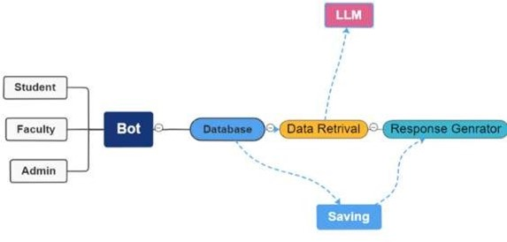
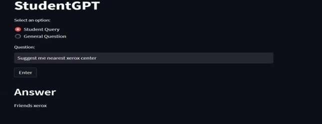
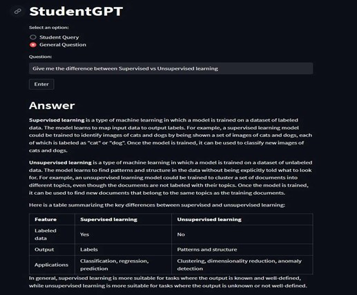
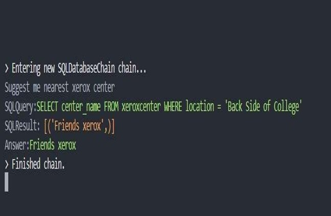
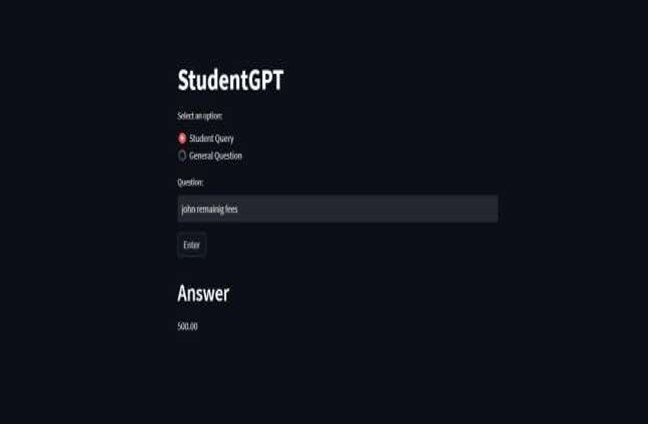

# StudentGPT

StudentGPT: Student Helper BOT

This is an end-to-end LLM project designed to assist students with academic inquiries using advanced language models. The system integrates with a MySQL database, allowing users to ask questions in natural language, which are then translated into SQL queries and executed to provide accurate answers.

Project Highlights

StudentGPT is an intelligent assistant that helps students by answering questions about their academic data, such as grades, attendance, and course details.
The academic data is stored in a MySQL database, and the system can handle queries related to various aspects of student information.

The project utilizes the following technologies:

Google Palm LLM

Hugging Face embeddings

Streamlit for UI

Langchain framework

Chromadb as a vector store

Few-shot learning

In the UI, users can ask questions in natural language, and the system will generate accurate responses based on the data.

Installation

Clone this repository to your local machine using:

bash

Copy code

git clone https://github.com/codebasics/langchain.git

Navigate to the project directory:

bash

Copy code

cd student_helper_bot

Install the required dependencies using pip:

bash

Copy code

pip install -r requirements.txt

Acquire an API key through makersuite.google.com and add it to the .env file:

bash

Copy code

GOOGLE_API_KEY="your_api_key_here"

For database setup, run database/db_creation_student_helper.sql in your MySQL workbench.

Usage

Run the Streamlit app by executing:

bash

Copy code

streamlit run main.py

The web app will open in your browser where you can ask academic-related questions.

Sample Questions

What is jonhs current fee?

How many xerox center near kbp college?

how many student having backlog last semester?

How many classes have I missed this semester?

Project Structure

main.py: The main Streamlit application script.

langchain_helper.py: Contains all the Langchain code.

requirements.txt: A list of required Python packages for the project.

few_shots.py: Contains few-shot prompts.

.env: Configuration file for storing your Google API key.

database/db_creation_student_helper.sql: SQL script for setting up the database.

